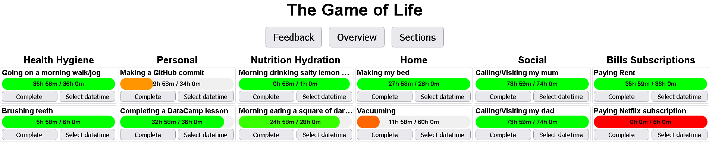
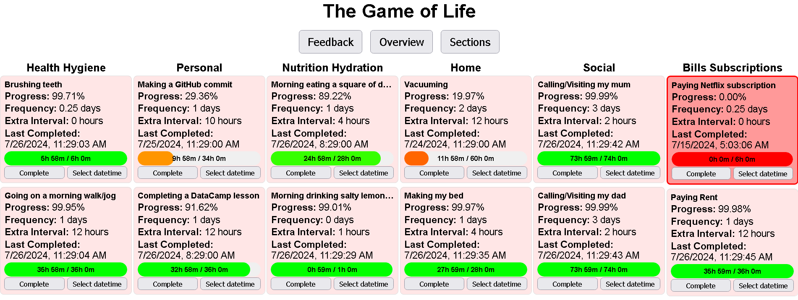
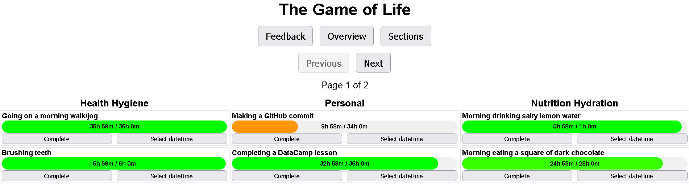
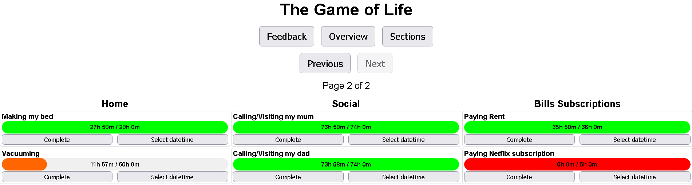

# TheGameOfLife

Simple web app to gamify your life and keep yourself accountable.

### The UI:









### Folder structure:

```
TheGameOfLife/
├── csv_files/ (6 items)
│   ├── nutrition_hydration.csv
│   ├── personal.csv
│   ├── health_hygiene.csv
│   ├── social.csv
│   ├── bills_subscriptions.csv
│   └── home.csv
├── game-of-life-frontend.html
├── game-of-life-backend.py
├── README.md
└── start-game-of-life.bat
```

### Dependencies:

- flask
- flask_cors
- pandas