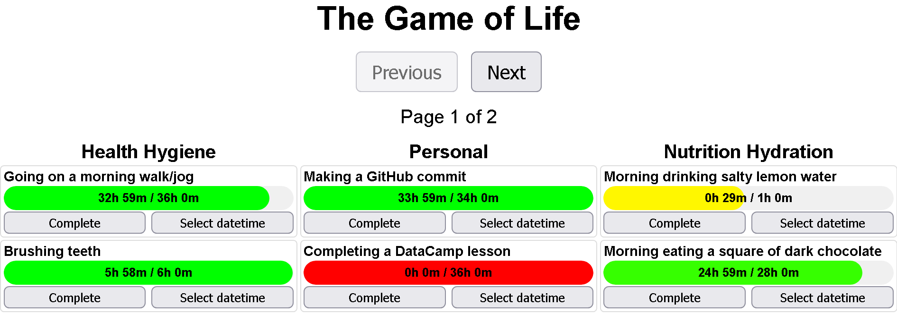

# TheGameOfLife

### The UI:



### Folder structure:

```
TheGameOfLife/
├── csv_files/ (6 items)
│   ├── nutrition_hydration.csv (176 bytes)
│   ├── personal.csv (153 bytes)
│   ├── health_hygiene.csv (148 bytes)
│   ├── social.csv (147 bytes)
│   ├── bills_subscriptions.csv (141 bytes)
│   └── home.csv (124 bytes)
├── TheGameOfLife-concept-art.png (76036 bytes)
├── game-of-life-frontend.html (19589 bytes)
├── game-of-life-backend.py (5945 bytes)
├── README.md (754 bytes)
└── start-game-of-life.bat (286 bytes)
```

### Dependencies:

- flask
- flask_cors
- pandas